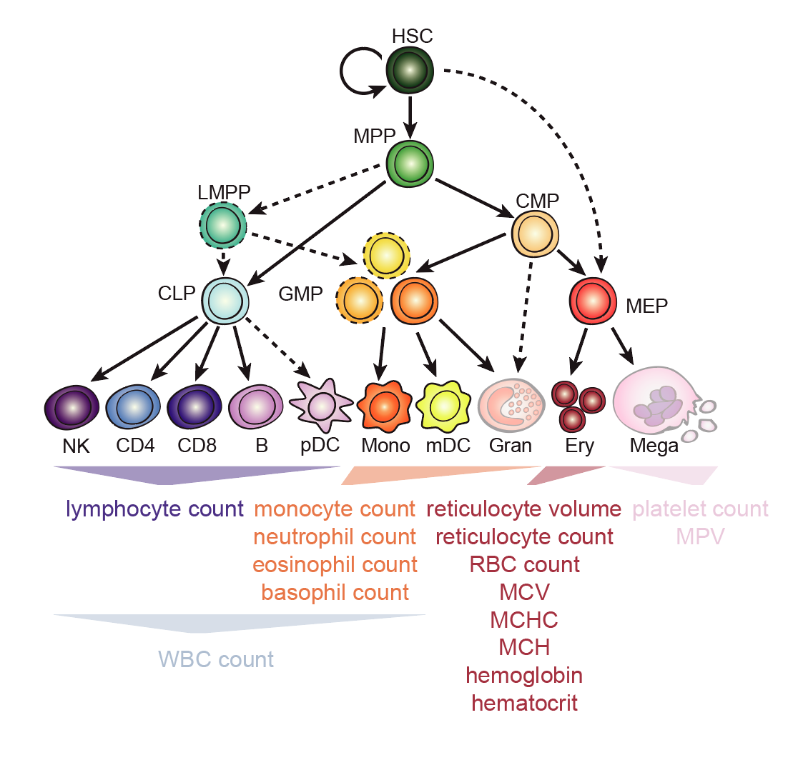
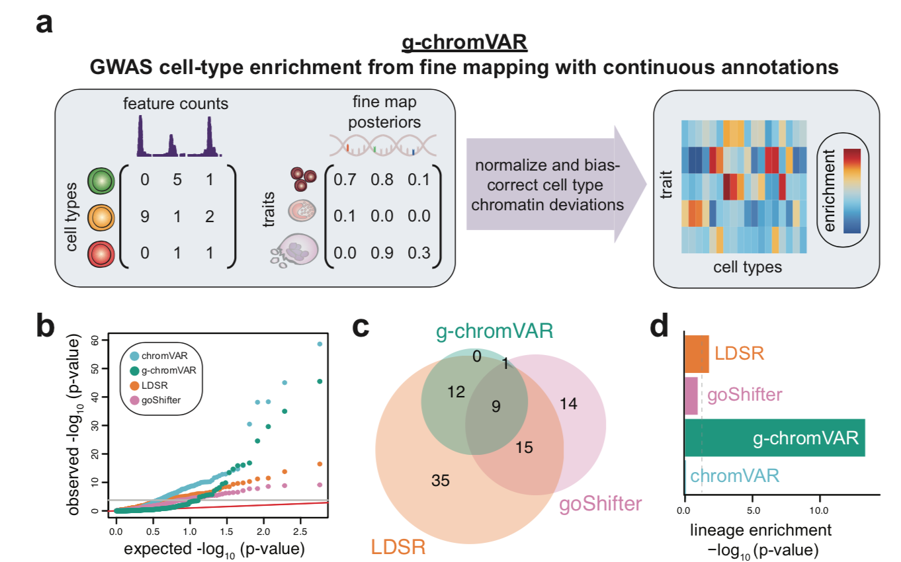
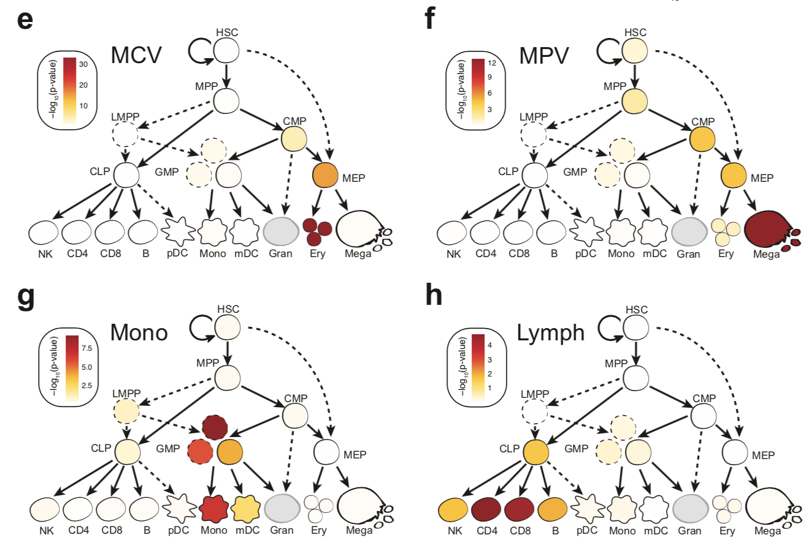

# gchromVAR


### About:

R package for computing cell-type specific GWAS enrichments
from Finemapping data and quantitative epigenomic data. 

<p align="center">
  <br><br><br>
  <br>
  <b>Figure 1</b>. Overview of hematopoesis with cell types (top) and GWAS traits (bottom) explored thus far with <b>gchromVAR</b>. 
</p><br><br>

More stuff here

<br>
<p align="center">
  <br><br><br>
  <br>
  <br>
  <b>Figure 2</b>. Schematic and overview of results when applying <b>gchromVAR</b> to bulk populations. 
</p>

### Installation:

Once all of the dependencies for `gchromVAR` are installed, the package can be installed 
directly from GitHub by typing the following into an `R` console:

```
devtools::install_github("caleblareau/gchromVAR")
```

### Contact:
[Caleb Lareau](mailto:caleblareau@g.harvard.edu) developed and maintains this package with Erik Bao and Jacob Ulirsch. 

<br><br>